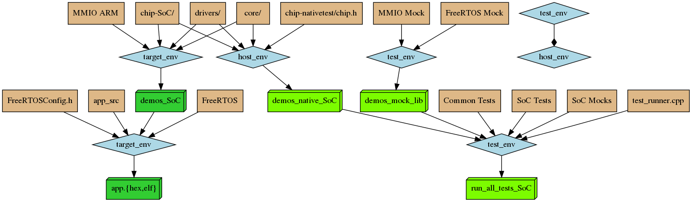

# Build process

The project uses [SCons](https://scons.org/documentation.html) as a software construction tool.
The word _Environment_ in this document refers to the [SCons Construction Environment](https://scons.org/doc/production/HTML/scons-user/ch07s02.html).
Refer to the SCons documentation for further details.

To build everything, simply type:

```
scons
```

After build finishes, you can run all tests by typing:

```
./run_all_tests.sh
```

## Overview

Somewhat simplified build diagram:



* Sources are in brown.

* Environments are diamond shaped and in light blue.

* Produced binaries are green. Target SoC specific binaries are in darker green, host binaries are in lighter green.

The two main deliverables of the build are:

* Applications

* Test Programs (i.e. programs that execute tests)

Note, that, as an intermediate step, the library is also built for every supported platform. Eventually, the goal is to have *library* as a main deliverable
in place of applications, but right now there is no simple way to build application outside of this repository. See issue #8. Until that is resolved,
the library is considered an "intermediate".

Next sections go into more details about how binaries are produced.

## Target Library {#target-library}

This is the Target SoC specific library. On the diagram above it is referred to as `demos_SoC`.
As noted above, for now this is considered to be an intermediate step.

The library is built from these parts (the names that end in `/` refer to directories in source code):

* `driver/` - defines common APIs for similar peripherals (SPI, I2C, etc.) and common functionality.

* `core/` - core concepts of the OS itself. These can sometimes wrap similar concepts in FreeRTOS.

* `chip-NAME/` - chip (SoC) specific code. In many cases these are implementations of the drivers,
    defined within `driver/` directory, but also define some properties of a chip, like number of
    supported IRQs.

* MMIO - for target code this layer translates the MMIO calls to, well, raw volatile memory reads
    and writes.

## Application

Applications use [Target Library](#target-library) specific to their SoC. FreeRTOS is built for every application separately,
because it needs a configuration (`FreeRTOSConfig.h`), which may be application specific.

Applications also have their own sources, which are the core of the application itself.

## Host Library {#host-library}

This one also sometimes referred to as "native" library. On the diagram above it is called `demos_native_SoC`.

The purpose of this library is to be used in tests.
Two parts of this library -- `core/` and `driver/` -- are the same as the ones in [Target Library](#target-library).
The key difference is in the MMIO layer. MMIO operations are translated into function calls, but no definition
for the functions themselves are provided, i.e. this becomes an external dependency. This will be exploited by
`MMIO Mock` below, to make testing on the host possible.

There is also a "nativetest" layer defined specifically for this library (`chip-nativetest/chip.h`), which simply defines
the SoC specific parameters to, well, some values so that the library will compile.

## Mock Library {#mock-library}

This library provides flexible implementations for the MMIO operations, which are left as external dependencies in Host Library.
*Flexible* here means that the results of the operations can be defined by the caller (presumably test writer) on the fly,
to reflect the needs of a specific test.

It also includes similar implementation for the FreeRTOS system calls, but this part is in the process of development, so
not much can be said (yet).

## Tests

The project uses [Catch2](https://github.com/catchorg/Catch2) test framework. Host Library and Mock Library come together
to provide fake hardware environment for drivers and other components under test.
